# Retinal Vessel Detection Using Matched Filter with First-order Derivative of Gaussian

## Introduction

This project implements the method introduced by Zhang et al. (2010) for extracting retinal blood vessels from retinal images using a matched filter with the first-order derivative of Gaussian (MF-FDOG). The goal is to enhance the sensitivity and specificity of vessel detection while minimizing false positives. This method is particularly useful in medical imaging applications, such as diagnosing diabetic retinopathy.

## Features

- **Dual Vessel Detection**: The algorithm distinguishes between wide and narrow vessels by using different filter parameters.
- **Enhanced Accuracy**: Combines matched filtering and first-order derivative of Gaussian to filter out non-vessel edges effectively.
- **Optimized for Performance**: Includes specific parameter tuning based on empirical studies to achieve high accuracy and low false positive rates.

## Dependencies

- MATLAB
- Image Processing Toolbox

## Installation

Clone this repository to your local machine:

```bash
git clone https://your-repository-url.git
cd your-repository-directory
```

## Usage

Load your retinal image and corresponding mask.
Run the `main.m` script to start the vessel extraction process.
The processed images will display thin vessels, thick vessels, and a combined result of both.

### Example

The following MATLAB code snippet demonstrates the core functionality:

```matlab
% Load image and mask
image = imread('path_to_image');
mask = imread('path_to_mask');

% Process image
double_depth_image = im2double(image);
gray_image = rgb2gray(double_depth_image);
smoothing = fspecial('average', [3 3]);
smoothed = imfilter(gray_image, smoothing);

% Detect vessels
x = ExtractRetinalVessels(smoothed, 1.5, 9, 22, mask, 2.3); % Wide vessels
y = ExtractRetinalVessels(smoothed, 1, 5, 22, mask, 2.3); % Narrow vessels

% Combine results
result_image = x | y;
imshow(result_image);
```


## Algorithm Overview

The implemented algorithm follows these steps:

1. **Preprocessing**:
   - Convert the input image to grayscale and apply average smoothing.

2. **Vessel Detection**:
   - Apply the matched filter and first-order derivative of Gaussian at different orientations.
   - Compute maximum filter responses.
   - Determine a dynamic threshold based on the responses and apply it to extract vessels.

3. **Postprocessing**:
   - Combine the results from wide and narrow vessel detection using a logical OR operation.

## Implemented Algorithm Validation

### Optimal Results

We used the following image as the base input for running the algorithm. On the left side is the original RGB image, and on the right side is the grayscale version:

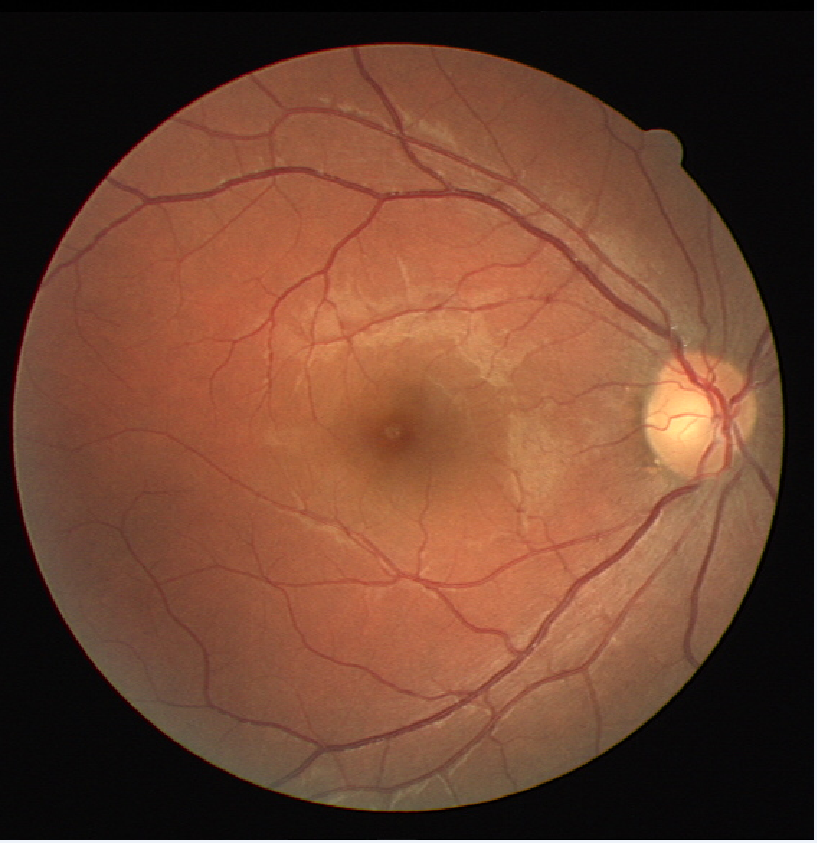 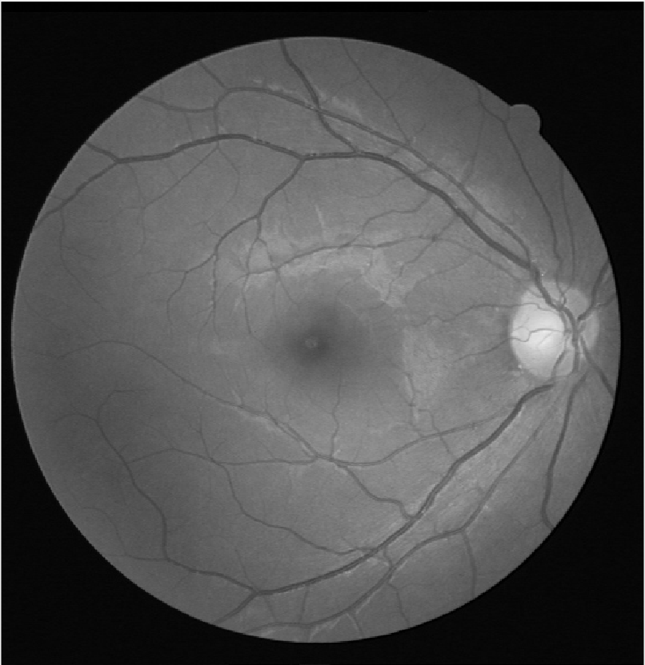

We executed the algorithm with the best-performing parameters as outlined in the paper: $s=1.5$, $L=9$ for detecting wide vessels, and $s=1$ and $L=5$ for detecting thin vessels, using a $31 \times 31$ filter with $c=2.3$. The results are shown below:

#### Thin Vessels Detection
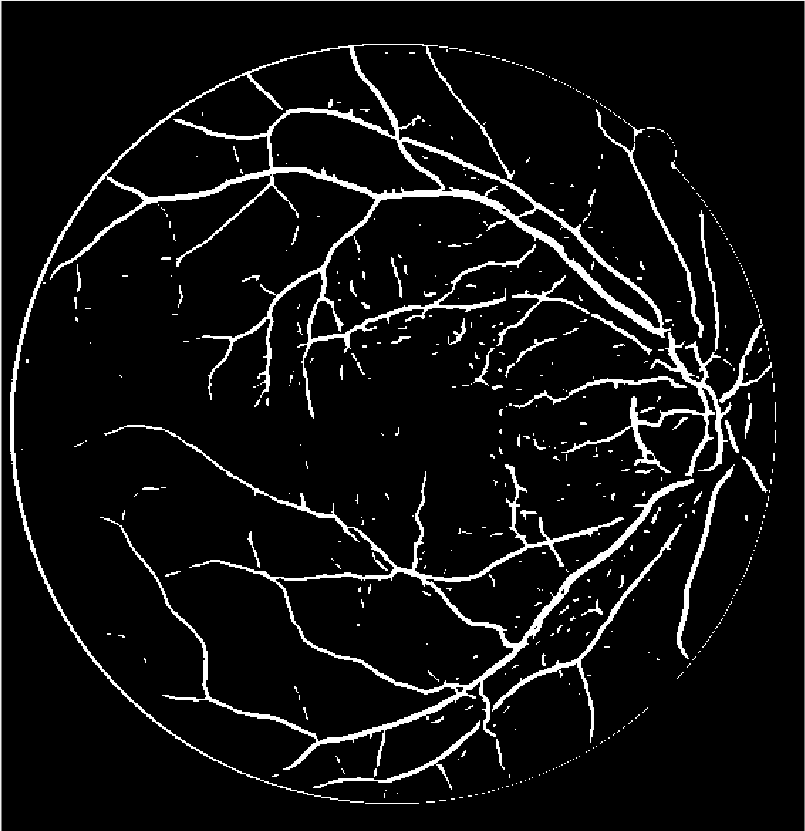

#### Thick Vessels Detection
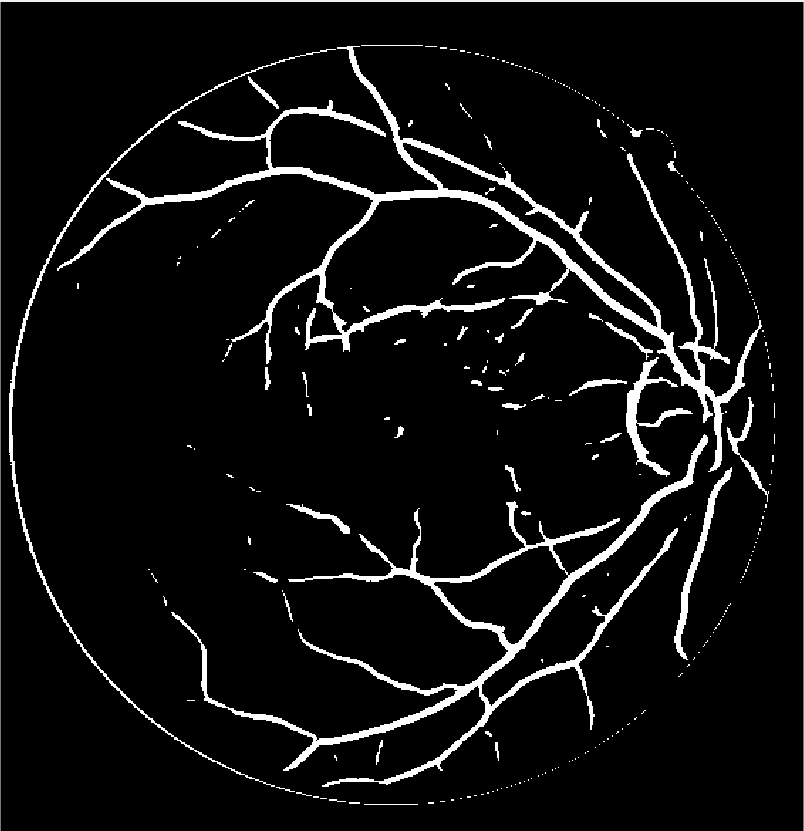

To detect both types of vessels simultaneously, we applied a logical OR operation to the results, resulting in the following combined vessels detection result:

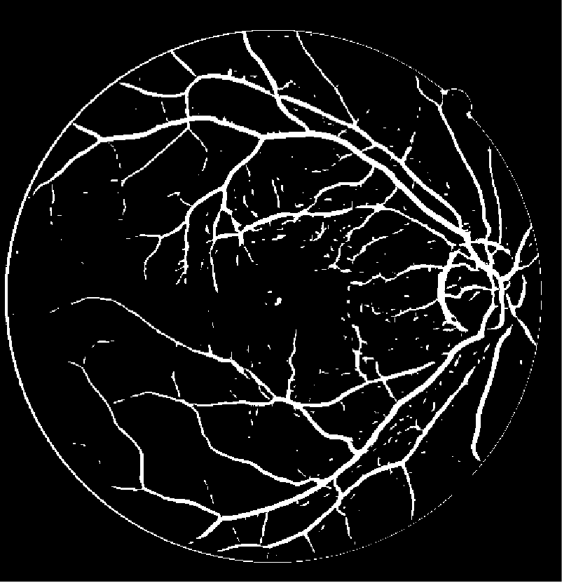

The combined image showcases the detection of both thin and thick vessels.


## Experimental Results for Different Hyperparameters

### s=0.5, L=2, c=2.3, W=31
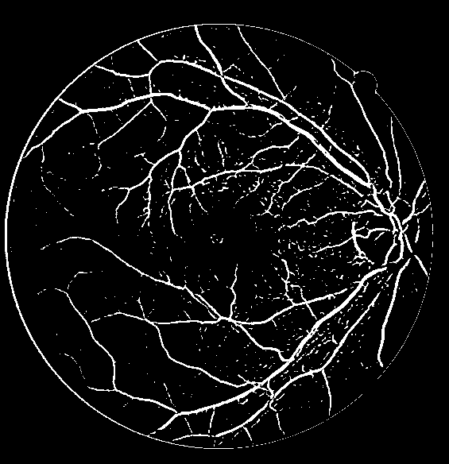

### s=0.5, L=2, c=5, W=31
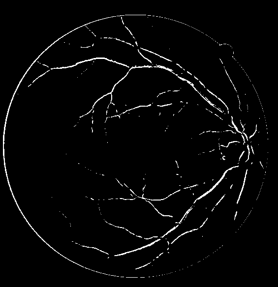

### s=1, L=5, c=2.3, W=2
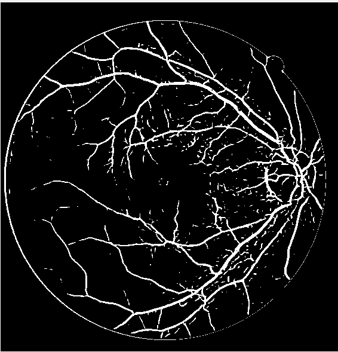

### s=1, L=5, c=2.3, W=90
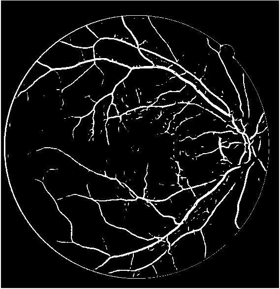

### s=2, L=9, c=0.5, W=31
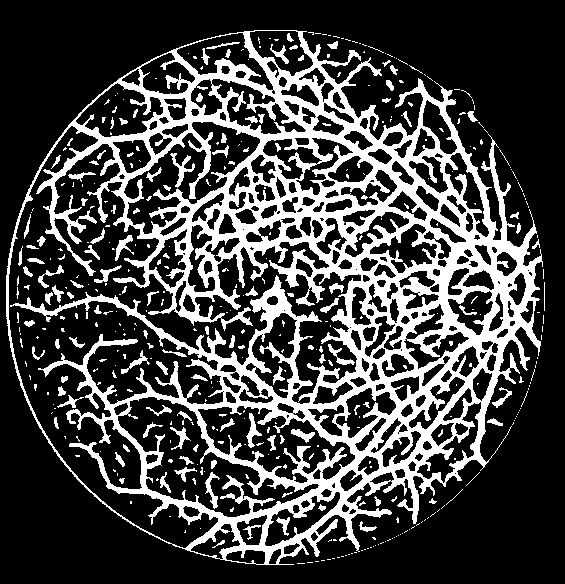

### s=2, L=12, c=0.5, W=31
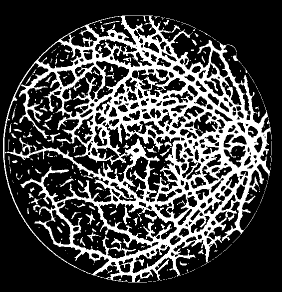

### s=3, L=9, c=5, W=31
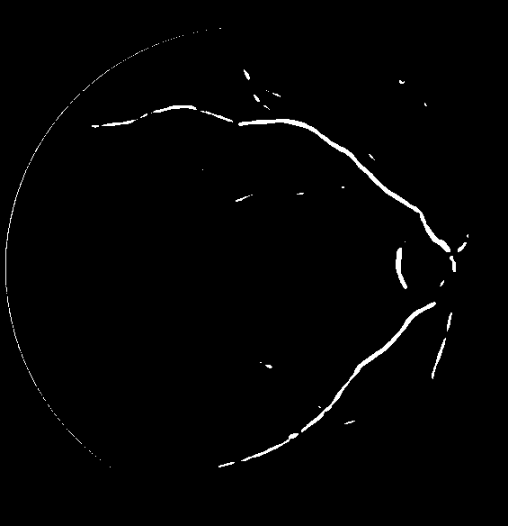

### s=3, L=12, c=5, W=31


## Conclusions

This project demonstrates the effectiveness of using MF-FDOG for retinal vessel detection. The method achieves high accuracy with minimal false positives, making it suitable for clinical applications. Further improvements could involve refining the hyperparameters based on additional empirical data or integrating machine learning techniques to automate the parameter selection process.

**For detailed explaination of the project, see the report.**

## References

1. S. Chaudhuri et al. “Detection of Blood Vessels in Retinal Images Using Two-Dimensional Matched Filters”. In: IEEE Trans. Med. Imaging 8.3 (1989), pp. 263– 269.
2. Jyotiprava Dash, Priyadarsan Parida, and Nilamani Bhoi. “Retinal Blood Vessel Extraction from Fundus Images Using Enhancement Filtering and Clustering”. In: Electronic Letters on Computer Vision and Image Analysis 19 (July 2020), pp. 38– 52. doi: 10.5565/rev/elcvia.1239.
3. A. Hoover, V. Kouznetsova, and M. Goldbaum. “Locating Blood Vessels in Retinal Images by Piecewise Threshold Probing of a Matched Filter Response”. In: IEEE Trans. Med. Imaging 19.3 (2000), pp. 203–210.
4. Bob Zhang et al. “Retinal Vessel Extraction by Matched Filter with First-Order Derivative of Gaussian”. In: Computers in Biology and Medicine (2010), pp. 438– 445.


